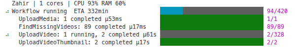
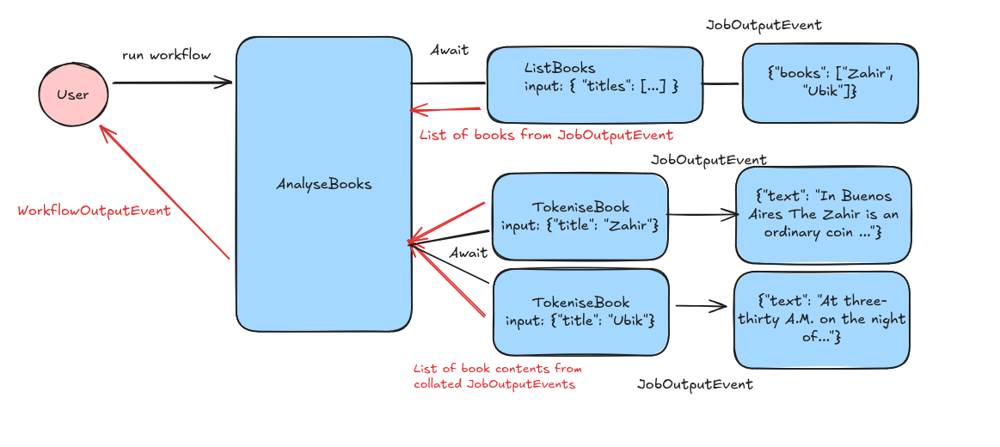
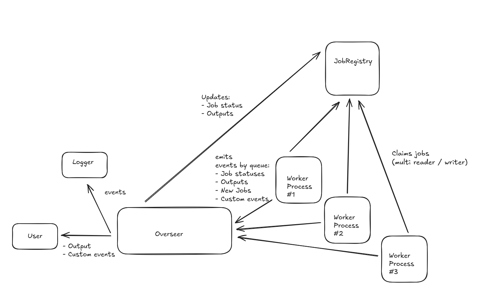

# 🪙 Zahir


[](https://codecov.io/gh/rgrannell1/zahir)

> Perhaps I shall conclude by wearing away the Zahir simply through thinking of it again and again.
> 
## Motivation

I'm writing a self-hosted digital library website, and I need a way of coordinating data-processing. My last workflow engine was written in PowerShell, so I'm not using that...



It'll also be useful for my [photo website backend](https://github.com/rgrannell1/mirror). Mirror has already been a nice testing-ground to see what features I need in reality, such as a resource-limiter to stop OOMing my laptop.

## File-Structure

```
src/
    context/
        memory.py              communicates workflow internals with dependencies and jobs
    dependencies/
        concurrency.py         await a free concurrency slot before starting a job
        group.py               await a group of dependencies
        job.py                 await a particular job-state
        resources.py           await enough CPU / RAM to not OOM...
        semaphore.py           allow pending jobs to be flagged impossible, depending on some supervisor process
        time.py                await a particular time-range before starting a job
    job_registry/
        sqlite.py              register jobs in SQLite
        state_event.py         emit events on job state-change
    serialisers/
    utils/
        id_generator.py        adjective-noun ids
        logging_config.py      shared logging setup
    jobs/
        decorator.py           a decorator to construct basic jobs from a function
    worker/
        state_machine/
            ...                each job-state and how it's handled
        call_frame.py          call-frame definitions used to manage paused jobs
        dependency_worker.py   check if dependencies are satistfied
        job_worker.py          claim and run a job freom the job registry
        local_workflow.py      the core workflow implementation
        overseer.py            manage the overall workflow execution
        progress.py            progress bar!
        read_job_events.py     handle job execution output

    base_types.py              abstract types for key Zahir abstractions
    events.py                  events describing workflow state-updates
    exception.py               exceptions thrown by Zahir
    scope.py                   handle translation from serialised data to instances
    serialise.py               serialise events as they pass between processes
```

## What is Zahir?

Zahir is not a DAG workflow engine or a traditional state-machine workflow engine. It is a dynamically expanding event-driven state-machine where state transitions are defined at runtime by running jobs. It does not statically define a workflow; the workflow unfolds from the starting step's execution.

There's tradeoffs. Static analysis is limited (we don't precompile a workflow structure like Airflow for example), and occasionally typing is also inexact (specifically when consuming output via a `JobDependency`). On the plus side, the dependency system covers all forms of constraint-based scheduling we could want; waiting for a HTTP resource, bailing if a file is already created, time-based scheduling, concurrency limiting. We can schedule jobs conditionally and dynamically, and workflow consumers can monitor and interact with the workflow via an eventing system. Jobs are just regular Python functions with a few optional attributes.

So Zahir is maximally expressive and extensible, at some cost to static analysability.

## A Simple Workflow

The following example workflow reads the text of a book, splits it into chapters, and `ChapterProcessor` computes the longest word in each chapter. `LongestWordAssembly` depends on these results, aggregates them, and emits an output event with the longest words by chapter.

```python
from zahir import (
    Await,
    Context,
    DependencyGroup,
    JobDependency,
    JobOutputEvent,
    LocalScope,
    LocalWorkflow,
    MemoryContext,
    SQLiteJobRegistry,
    WorkflowOutputEvent,
    job,
)

@job()
def ChapterProcessor(context: Context, input, dependencies) -> Iterator[JobOutputEvent]:
    """For each chapter, find the longest word."""

    # return the longest word found in the chapter
    yield JobOutputEvent({"longest_word": get_longest_word(input["lines"])})

@job()
def BookProcessor(context: Context, input, dependencies) -> Generator[Await | Job | JobOutputEvent]:
    longest_words = yield Await([
        ChapterProcessor({"lines": chapter_lines}, {}) for chapter_lines in read_chapters(input["file_path"])
    ])

    long_words = set()

    for summary in longest_words:
        if summary is not None:
            long_words.add(summary["longest_word"])

    uppercased = yield Await(UppercaseWords({"words": list(long_words)}, {}))

    yield WorkflowOutputEvent({"longest_words": uppercased["words"]})

@job()
def UppercaseWords(context: Context, input, dependencies) -> Iterator[JobOutputEvent]:
    """Uppercase a list of words."""

    yield JobOutputEvent({"words": [word.upper() for word in input["words"]]})
```

Jobs can be started without much boilerplate. By default:
- Workflows will register all jobs / dependencies loaded in a file to a scope object internally. the `Scope` is needed to translate between classes and serialised data.
- Job execution will be coordinated in an in-memory SQLite database.

```py
for event in LocalWorkflow().run(BookProcessor({"file_path": "./war-and-peace.txt"}, {})):
    print(event) # WorkflowOutputEvent({ "longest_words_by_chapter": [...] })
```

## Constructs



Workflows can be modelled with a few primitives:

### Jobs - Do things & arrange for more things to be done

Jobs do something, based on an input. They can have dependencies that must be met before they run. If they throw an unhandled exception, an optional recovery workflow is scheduled (essentially a "catch" handler).

Workflows comprise jobs that create other jobs. They aren't a separate abstraction; jobs yield further jobs they wish to complete after the current one. This can be done with conditional logic (so conditional workflows are of course supported). No automatic guarantee is given on job execution order (everything that can be run in parallel, is run in parallel). Jobs can however depend on other jobs and their outputs via a `JobDependency`. This allows patterns such as "process each item, await completion & update a database".

Rollbacks are also not separate abstractions; if something goes wrong, detect it and schedule tasks to remediate it. Job-level rollbacks do not compose into workflow rollbacks; crouching, stepping backwards, and taking off your parachute will not get you back on your plane.

Jobs generally pass data to child-jobs through parameters, then yield those jobs to continue the workflow. This somewhat mimics the callback-pattern / continuation-style-passing found in JavaScript. I don't remember this pattern fondly. So, Zahir has friendlier concurrency tools:

**1. Awaiting**

Zahir jobs are generators; they can await other Zahir jobs using the `Await` event in the following manner:

- Job A runs `result = yield Await(NewJob({...}, {...}))`
- Job A is paused, and we execute `NewJob` through Zahir and capture its output
- Job A is resumed with the output of `NewJob`

Note that once Job A is started, we cannot serialise it in "half-completed" state. So it remains in-memory until it's completed. The engine waits for the new task's dependencies to resolve & for the
job to complete before resuming Job A. `Promise.all([])` style execution is also supported

- Job A runs `result = yield Await([ job_b, job_c, ... ])`
- Job A is paused until the new jobs are completed
- Job A is resumed with a list of outputs, one per job.

Awaited jobs may also throw exceptions if they were given invalid input, threw an non-recoverable exception, or timed-out.

Jobs should have most of their logic factored out into plain functions; the job itself should just take input, call the necessary library functions, event, and delegate to other jobs.

**2. JobDependencies**

We can access the output of a job, if any, by inspecting the job-dependency a task might take.

- Job A spawns N batch jobs
- Job B awaits this jobs via `list[JobDependency]`
- On completion, Job B can access the output data from this array of jobs

This is a second way in which a "fan-out, then aggregate" pattern can be implemented in Zahir.

### Dependencies - Await some precondition before doing things

Jobs may have preconditions before running.

- `ConcurrencyLimit`: this dependency is satisfied when the concurrency limit is beneath a cap. Jobs are responsible for acquiring / freeing the concurrency limit when the job starts.
- `JobDependency`: this dependency is satisfied when another job reaches a requested state.
- `TimeDependency`: this dependency is satisfied when the workflow is in a certain time range.
- `GroupDependency`: used to consolidate several dependencies into a single aggregate dependency
- `ResourceLimit`: satistifed when CPU / memory are below some fixed percentage machine-wide
- `Semaphore`: a dependency that can be "toggled" by a supervisor process

Dependencies can be flagged as impossible to fulfill; jobs with impossible dependencies are removed from the `pending` queue and flagged in the event registry.

Dependency implementations must be serialisable to JSON.

### Events - Communicate how the workflow is going

Zahir communicates changes in workflow state as a stream of events emitted by `workflow.run`. These events include metadata. Most are emitted internally by the workflow engine itself:

- `JobCompletedEvent`
- `JobEvent`
- `JobIrrecoverableEvent`
- `JobPausedEvent`
- `JobPrecheckFailedEvent`
- `JobRecoveryCompletedEvent`
- `JobRecoveryStartedEvent`
- `JobRecoveryTimeoutEvent`
- `JobStartedEvent`
- `JobTimeoutEvent`
- `WorkflowCompleteEvent`
- `WorkflowStartedEvent`
- `ZahirEvent`
- `ZahirInternalErrorEvent`

A few can be used by jobs to communicate with the workflow engine:

- `Await`: wait for the result (or an error) from another job before resuming this one
- `JobOutputEvent`: return output from a job. Treated as a singular return; the task is dropped after this event is yielded.
- `WorkflowOutputEvent`: yield output from the workflow. Workflows yield a stream of outputs; since many workflows are long-running it's better to yield results as we go
- `ZahirCustomEvent`: whatever additional events you'd like to emit

### Registries - Store workflow state

Workflow orchestrators need to store some operational data. The job-registry keeps track of which jobs exist, their outputs, what state they are in, and how long they ran for.

### Scope - Convert from data to classes

We serialise jobs and dependencies to our registries for storage. We need to translate this data back to the associated Python classes. `Scope` implementations handle this translation. Jobs and Dependencies have to be explicitly registered with a scope for a non-local workflow to run.

### Transforms - Modify Jobs

Transforms modify job behaviour. For example, they can apply retries or logging to the underlying job without modifying it.

```python
from zahir import job, JobOutputEvent, LocalWorkflow

@job()
def FetchData(spec_args, context, input, dependencies):
    response = requests.get(input["url"])
    response.raise_for_status()

    yield JobOutputEvent({"data": response.json()})


retrying_fetch = FetchData.with_transform("retry", {
    "max_retries": 3,
    "backoff_factor": 1.0  # 1s, 2s, 4s backoff
})


for event in LocalWorkflow().run(retrying_fetch({"url": "https://api.example.com/data"}, {})):
    print(event)
```

Transforms are stored with the job when serialized, so retry behavior persists across workflow restarts.

## Modelling Workflows

### Scheduling

Zahir does not have a dedicated scheduling feature, since there's many ways to approach scheduling. Jobs run under certain conditions and yield further jobs; jobs are all schedulers of a sort.

Still, more practically, use a `TimeDependency` for simple time-based scheduling. For something more complex, model scheduling as a workflow which depends on some predicate about the world-state to be true through a custom dependency.

### Idempotency

We often want to run a workflow job to achieve a certain state (e.g create a resource). We have two options:

1. Use `once=True` as a job argument to ignore jobs of the correct type that have already used those parameters
2. Construct a dependency that's impossible if the resource exists. This is tidier, where possible.

### Checkpointing

There are a few overlapping terms here, but each is worth addressing:
- **Job-level checkpointing**: each step of workflow execution is persisted to disk (with the exception of mid-run tasks that use `Await`).
- **Job-level rollback**: supported via a mix of `recover` method, which handles unhandled job-exceptions, and just try-catching in your job on actions that might fail then remediating by scheduling cleanup jobs
- **Branch-level checkpointing / rollbacks**: "try to do XYZ, if that fails recover in this fashion" is possible using `Await`. Attempt to complete the branch, try-catch for failure, and on failure schedule an alternative course of action. Exceptions are not required for this branching logic; it's perfectly valid to `if-else` based on the output of a job's awaited output into different conditional branches of job-execution.

```python
try:
    result = yield Await(YourBranchJob(...))
except Exception as err:
    ... # tidy-up
```

### Job-Expiration

Jobs generally have a useful period in which we'd like to execute them (today, not a week from now, for example). This can be codified by using a `TimeDependency` with a `before` condition

### Parallel API Access

Use a `ConcurrencyLimit` with the appropriate concurrency limit and slots (roughly, how many calls we'll make) to make API calls within a concurrency limit. Make sure to actually _use_ the limiter, otherwise it won't free the reserved slots! E.g

```python
cdn_limit = dependencies.get("cdn_limit")

with cdn_limit:
    cdn.upload(...)
```

### Inter-Job Communication

In most cases you should simply call a job and await its results. For more complex inter-job communicatation, the `context` object can create queues. Pass the queue **id** to subjobs, not the queue instance. Subjobs can then get the queue using this ID.

```python
# pass the queue ID to subjobs
queue_id, queue = context.add_queue()

# Subjobs can get the queue by this ID.
queue = context.get_queue(queue_id)
```

### Storing State

In order of my preferences:

1. Simply pass data between jobs as parameters and returns
2. Use an external data-store
3. Use `context.state` to store "global" variables

I think in virtually all cases option `1` will be enough. The only likely exception I can see if for propegating things like configuration values / flags into all jobs without updating every input type.

### Cancellation

Zahir supports two patterns of starting jobs:

- Yielding jobs in a "non-blocking" fashion
- Awaiting on yielded jobs, which blocks the current task until all subjobs complete

For the latter case, we "cancel" by changing how we execute things after awaited jobs fail or return a certain output. We can re-raise errors futher up the awaited job-stack to propegate failure much like typical procedural program execution.

Cancellation is more relevant for non-blocking jobs, which may be long-lived supervisor jobs that launch subjobs themselves. The following example shows a pattern for propegating cancellation signals; construct a `Semaphore` dependency (`satisfied` by default), and on error mark all consumers of that dependency as impossible to schedule. Any long-running jobs can introspect on the semaphore directly and end when the semaphore is marked as `impossible`

```python
sem = Semaphore()
yield MySupervisorJob({}, { "cancelled": sem })

try:
    yield Await(SomeCriticalStepJob({}, {}))
except Exception as err:
    sem.abort()
    raise err
```

This prevents new jobs from being scheduled, but does not cancel currently active jobs. I don't plan on adding this feature.

## Retries

Zahir supports retries via the built-in `retry` transform. This transform runs your primary job as a child task, catches failures, waits with exponential backoff, and runs again after a delay on failure.


## Execution



Zahir is a multi-process workflow engine that shares workflow state through cross-process event-queues.

The overseer constructs worker processes, which poll the job-registry for any jobs ready to run. After claiming the job, the worker streams events describing the job state, its outputs, timeouts, and any futher jobs to be run to the overseer. The overseer updates the job-registry in turn with this information, and relays events on to the logger and whichever function invoked the workflow.

Jobs transition through many states during execution. Healthy jobs transition through the chain of states:

Pending → Ready → Running → [Paused] → Complete


The workflow engine itself doesn't care much about workflow states; it will continue to run what it can. Jobs can however introspect on their dependency jobs states and react accordingly; maybe continue as is, report different output, or declare the job impossible.


## Development

```
rs format
```

```
rs lint
```

```
rs check && rs check:mypy
```

```
rs test
```

## License

Copyright (c) 2025 Róisín Grannell

Permission is hereby granted, free of charge, to any person obtaining a copy of this software and associated documentation files (the "Software"), to deal in the Software without restriction, including without limitation the rights to use, copy, modify, merge, publish, distribute, sublicense, and/or sell copies of the Software, and to permit persons to whom the Software is furnished to do so, subject to the following conditions:

The above copyright notice and this permission notice shall be included in all copies or substantial portions of the Software.

THE SOFTWARE IS PROVIDED "AS IS", WITHOUT WARRANTY OF ANY KIND, EXPRESS OR IMPLIED, INCLUDING BUT NOT LIMITED TO THE WARRANTIES OF MERCHANTABILITY, FITNESS FOR A PARTICULAR PURPOSE AND NONINFRINGEMENT. IN NO EVENT SHALL THE AUTHORS OR COPYRIGHT HOLDERS BE LIABLE FOR ANY CLAIM, DAMAGES OR OTHER LIABILITY, WHETHER IN AN ACTION OF CONTRACT, TORT OR OTHERWISE, ARISING FROM, OUT OF OR IN CONNECTION WITH THE SOFTWARE OR THE USE OR OTHER DEALINGS IN THE SOFTWARE.
